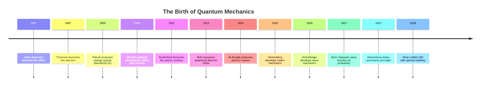

# The Quantum World — Why Everything You Know Is Wrong

:::{figure} ../images/ch01-infographic.png
:label: fig-ch01-infographic
:alt: Illustrated explainer infographic for Chapter 1 covering classical vs quantum physics, the three anomalies, quantization, probability, and wave functions
:width: 80%
:align: center

Chapter 1 overview: From classical intuition to quantum reality — the journey every programmer must take.
:::

---

## The First Day That Changed Everything

Picture this: It's a Monday morning in January 2024. A software engineer — let's call her Maya — walks through the glass doors of IBM's quantum computing lab in Yorktown Heights, New York. She's been hired as a quantum software developer. Her résumé is impeccable. Five years of distributed systems. Deep Python fluency. Two open-source contributions to NumPy. She is, by any reasonable measure, an excellent programmer.

Her new manager hands her a printed circuit diagram and says, cheerfully, "Start here."

Maya stares at it. The symbols are unfamiliar. The logic gates don't behave like any gates she's ever seen. Some gates seem to operate on states that are simultaneously 0 and 1. There are operations that look like they produce *probabilities* instead of definite values. One gate appears to link two physically separate bits in a way that shouldn't be physically possible. Her classical intuition — the mental model she's spent years sharpening — gives her absolutely nothing. It's like trying to debug C++ with a JavaScript mental model. The syntax is close enough to be confusing, but the runtime semantics are completely alien.

She's not dumb. She's not undertrained. She's running the wrong operating system in her head.

That's what this chapter is about. Before you can write a single quantum circuit, before you can reason about qubits and gates and algorithms, you need to understand *why* the universe at small scales behaves so strangely. You need to understand where quantum mechanics came from, what it actually claims, and why those claims are not approximations or metaphors — they are the literal, verified, tested-to-eleven-decimal-places truth about how reality works.

By the end of this chapter, Maya's circuit diagram will start to make sense. And so will the entire field of quantum computing.

Let's start at the beginning.

---

## The Old OS: Classical Physics

You already understand more physics than you think.

When you write a program, you operate in a world of certainty. A variable holds exactly one value. A function, given the same inputs, always produces the same output. A process is either running or it isn't. A bit is either 0 or 1. These aren't just programming conventions — they reflect something deep about the physical world as we experience it at human scales. They are the rules of **classical physics**.

Newton gave us this operating system in the late 1600s, and it is *magnificent*. Three laws of motion. A law of universal gravitation. Clean, deterministic, and astonishingly accurate. If you know the position and velocity of every particle in a system at time T, you can calculate exactly where every particle will be at time T+1. No ambiguity. No probability. Just math.

Think of classical physics as a legacy codebase that's been in production for three centuries. It is:

- **Well-documented.** The equations are in every textbook.
- **Battle-tested.** We used it to put humans on the moon, design bridges, and build every combustion engine ever made.
- **Deterministic.** Same inputs, same outputs, every single time.
- **Intuitive.** A ball thrown through the air follows a parabola. Always. No surprises.

```python
# Classical physics in pseudocode
def classical_particle(position, velocity, force, mass, dt):
    """
    Given exact initial conditions, predict exact future state.
    Deterministic. No probability. No ambiguity.
    """
    acceleration = force / mass
    new_velocity = velocity + acceleration * dt
    new_position = position + velocity * dt
    return new_position, new_velocity  # Always the same answer
```

This is the mental model you carry into any engineering problem. State is knowable. Transitions are predictable. The universe is, at its core, a giant deterministic state machine.

Here's the thing.

That mental model is *wrong* at small scales. Not approximately wrong — fundamentally, structurally, irreparably wrong. And figuring out *how* wrong it was took some of the smartest people in history about 30 years, several Nobel Prizes, and more than a few existential crises.

:::{note}
Classical physics isn't *false* — it's *incomplete*. For everyday objects (cars, planets, you and me), classical physics is accurate to many decimal places. It fails only at atomic and subatomic scales. Think of it like floating-point arithmetic: works great for most numbers, breaks down at the extremes.
:::

---

## The Cracks Appear

By the year 1900, physicists were feeling good about themselves. They had Maxwell's equations for electromagnetism. They had Newtonian mechanics. They had thermodynamics. A prominent physicist reportedly said that all the major discoveries had been made — future physicists would just be adding decimal places.

Then three anomalies showed up that no amount of decimal-place-adding could fix.

### Crack #1: The Ultraviolet Catastrophe

Imagine heating a piece of metal until it glows. It starts red, then orange, then white-hot. Physicists in the 1890s wanted to predict exactly how much light a hot object emits at different colors (frequencies). This is called **blackbody radiation**.

They had perfectly good classical equations for it. They ran the math. And the math said something terrifying: a hot object should emit *infinite* energy, mostly at ultraviolet frequencies.

Not "a lot" of energy. Infinite. As in, every warm object in the universe should be spewing out unlimited radiation and instantly destroying everything. Your coffee mug, sitting on your desk right now, should be a death ray.

Obviously, it isn't. The universe disagrees with the math.

A young physicist named Lord Rayleigh worked through the derivation multiple times. His colleague James Jeans checked it. The math was correct. Classical physics predicted infinite energy from heated objects. Real heated objects did not produce infinite energy. These two facts could not both be true. Classical physics was wrong.

This wasn't a rounding error. This was a catastrophic, universe-ending failure of the prevailing theory. They called it, with British understatement, "the ultraviolet catastrophe."

:::{figure} ../images/ch01-blackbody-radiation.png
:label: fig-ch01-blackbody
:alt: Blackbody radiation curve showing classical prediction (ultraviolet catastrophe) vs quantum prediction
:width: 75%
:align: center

The classical prediction (Rayleigh-Jeans law) diverges to infinity at high frequencies — the "ultraviolet catastrophe." Planck's quantum formula matches reality perfectly.
:::

### Crack #2: The Photoelectric Effect

In 1887, Heinrich Hertz was experimenting with light and metal surfaces. When he shone light on a metal plate, electrons were ejected from the metal surface. This is called the **photoelectric effect**, and it would eventually power solar cells and digital cameras.

Here's what classical physics predicted: if you want to eject more electrons, use *brighter* light. More light energy means more electrons knocked loose. Simple.

Here's what actually happened: brightness didn't matter. Frequency did. A dim blue light ejected electrons. A blazing bright red light ejected *none*. No matter how much red light you threw at the metal, the electrons wouldn't budge. But a tiny sliver of blue light? Electrons flying everywhere.

Classical physics had no explanation. Light was a wave. Waves transfer energy continuously. More bright wave equals more energy transferred. There was no reason why red light, no matter how intense, couldn't eventually knock loose an electron if you just waited long enough.

But that's not what happened. Experimenters doubled the brightness. Tripled it. The result was always the same: wrong color, no electrons. Right color, electrons. Instantly.

:::{figure} ../images/ch01-photoelectric-effect.png
:label: fig-ch01-photoelectric
:alt: Diagram of the photoelectric effect: light hitting metal surface, electrons ejecting, with photon packets labeled
:width: 75%
:align: center

The photoelectric effect: frequency determines whether electrons are ejected, not brightness. Classical wave theory could not explain this.
:::

### Crack #3: The Spectral Lines of Hydrogen

Heat hydrogen gas until it glows, then pass that glow through a prism. You expect a smooth rainbow — a continuous smear of all colors. That's what classical physics predicts: electrons orbiting the nucleus, oscillating, radiating energy across the full spectrum.

Instead, you get a barcode.

Thin, precise, razor-sharp lines of specific colors. Four visible lines. Just four. The same four lines, every single time, for every sample of hydrogen on Earth — or in a distant star observed through a telescope. Hydrogen has a *fingerprint*, and it's made of exactly four colors.

Classical physics could produce literally any prediction about what those lines should be — it had no mechanism to explain *why* there should be discrete lines at all, let alone why those specific lines and no others.

:::{figure} ../images/ch01-hydrogen-spectral-lines.png
:label: fig-ch01-spectral
:alt: Hydrogen emission spectrum showing discrete colored lines on black background, labeled with wavelengths
:width: 75%
:align: center

Hydrogen's emission spectrum: four sharp lines at exactly 656nm, 486nm, 434nm, and 410nm. Classical physics had no explanation for why these specific colors — and only these — were emitted.
:::

Three anomalies. Three places where the classical operating system crashed with a blue screen of death. And physics had no recovery path.

:::{dropdown} Why These Three Anomalies Matter
These weren't isolated curiosities. Each anomaly pointed at the same underlying problem: **classical physics assumed energy was continuous**. Like a float in your program — any value between two bounds was valid. What the data kept insisting was that energy came in **discrete chunks**. Like integers. Like enums. Like a lookup table with specific allowed values and nothing in between.

Fixing classical physics wasn't a matter of tweaking a constant. It required replacing the fundamental assumption about how energy works.
:::

---

## Planck's Desperate Hack

Max Planck was a conservative man. He believed deeply in classical physics and spent his career trying to rescue it.

In 1900, he sat down with the blackbody radiation problem and tried everything the classical framework offered. Nothing worked. The ultraviolet catastrophe persisted. In frustration, he tried something he considered mathematically distasteful: he assumed, *just for the purpose of making the math work*, that energy could only be emitted in discrete chunks. Tiny packets. He called them "quanta" (from the Latin for "how much").

He wasn't claiming this was real. He was doing what any experienced programmer does when they can't find the elegant solution: he hard-coded a constant.

```python
# Planck's approach — pseudocode metaphor
def classical_energy_emission(frequency):
    """Classical prediction: energy is continuous, emitted at any value."""
    return classical_formula(frequency)  # → INFINITY at high frequencies 💥

# Planck's "hack":
h = 6.626e-34  # Planck's constant — a magic number he couldn't explain

def quantum_energy_emission(frequency, n):
    """
    Assume energy only comes in integer multiples of h*frequency.
    n must be an integer: 1, 2, 3, ... (not 1.5, not 2.7)
    """
    energy_quantum = h * frequency
    return n * energy_quantum  # Works! But WHY does n have to be an integer?
```

The formula fit the experimental data *perfectly*. Every data point. Every temperature. Every frequency. The ultraviolet catastrophe vanished.

Planck was horrified. He spent years trying to derive his quantum formula from classical principles — to show that the discrete energy assumption was just a mathematical convenience that would eventually resolve into a proper continuous theory. He couldn't. Nobody could.

"It was an act of desperation," he later said. "I had to obtain a positive result under any circumstances and at whatever cost."

This is one of the most relatable moments in the history of science. He found a magic constant that made the bug go away. He committed it to production. He spent years trying to understand *why* it worked and never fully succeeded.

:::{figure} ../images/ch01-planck-constant.png
:label: fig-ch01-planck
:alt: Visual metaphor for quantization: energy as a staircase (discrete steps) vs a ramp (continuous). Infographic style.
:width: 70%
:align: center

Quantization: classical physics treats energy like a ramp (any value allowed). Quantum mechanics treats it like a staircase — only specific values exist.
:::

:::{important}
Planck's constant **h = 6.626 × 10⁻³⁴ joule-seconds** is one of the fundamental constants of nature. It sets the *scale* at which quantum effects become important. For large objects, the steps of the staircase are so tiny they look like a ramp. For atoms and electrons, the steps are enormous relative to the system — and quantum effects dominate.
:::

---

## Einstein Doubles Down

Five years later, a 26-year-old patent clerk in Bern, Switzerland was reading the literature on the photoelectric effect. His name was Albert Einstein, and he was doing what great engineers do: taking someone else's hack and asking *what if this is actually correct?*

Planck had assumed energy was emitted in discrete packets. Einstein asked: what if light itself *is* discrete? What if light doesn't just come in chunks when it's emitted — what if it's fundamentally composed of particles, even as it travels?

He called these particles **photons**. And with that single assumption, the photoelectric effect became trivial to explain.

One photon hits one electron. Either the photon has enough energy to knock the electron loose, or it doesn't. Doubling the number of photons (brighter light) just means more photons, but if each photon is still too weak, none of them will dislodge an electron. To eject an electron, you need a single photon with sufficient energy — which means you need higher frequency (bluer) light, because photon energy scales with frequency: **E = hf**.

The math was clean. The predictions were exact. The photoelectric effect, which had baffled physics for nearly two decades, fell apart in a few pages of algebra.

Imagine Einstein in the Bern patent office in 1905, the morning light coming through the window. He's reviewing someone else's invention — probably something mechanical, something classical. On his lunch break, he opens the journal paper on the photoelectric effect. He stares at the data. The classical predictions are wrong. Planck's quantum idea is whispering at the edges. And then the thought crystallizes: *Light is a particle*. Not sometimes. Always. The wave behavior we see is an emergent phenomenon. At its core, light comes in bullets.

He writes the paper in three weeks. Submits it. This paper — not his theories of relativity — is what wins him the Nobel Prize in 1921.

:::{note}
Einstein's 1905 paper on the photoelectric effect is the one the Nobel Committee cited. Relativity was considered too speculative at the time. The photoelectric effect was concrete, testable, and its predictions were experimentally verified. This is a good reminder: in science as in engineering, *working code* beats *elegant architecture*.
:::

---

## Bohr's Atom: The First Quantum Model

Now that energy and light were quantized, a Danish physicist named Niels Bohr tackled the hydrogen spectral lines.

Here's the setup: classical physics said electrons should orbit the nucleus like planets orbit the sun. But here's the problem — orbiting means accelerating (even circular motion is acceleration). And accelerating charged particles emit radiation. Which means the electron should continuously lose energy, spiral inward, and crash into the nucleus in about 10⁻¹¹ seconds.

Atoms, as you may have noticed, are not constantly collapsing. So classical physics was, again, wrong.

In 1913, Bohr proposed something radical: electrons don't orbit at *any* distance they want. They can only orbit at *specific* distances from the nucleus — specific energy levels. Between those levels, there is nothing. An electron can't be at an intermediate distance, any more than a variable with an `enum` type can hold a value that's not in the enumeration.

```python
# Bohr's atom as a type system
from enum import Enum

class ElectronEnergyLevel(Enum):
    GROUND_STATE   = 1   # n=1, closest to nucleus, lowest energy
    FIRST_EXCITED  = 2   # n=2
    SECOND_EXCITED = 3   # n=3
    THIRD_EXCITED  = 4   # n=4
    # ... and so on
    # There is NO n=1.5. No n=2.7. No floats. Integers only.

def electron_transition(from_level: ElectronEnergyLevel, 
                         to_level: ElectronEnergyLevel) -> float:
    """
    When an electron jumps between levels, it emits or absorbs
    a photon with exactly the energy difference. No more. No less.
    """
    energy_emitted = energy(from_level) - energy(to_level)
    photon_frequency = energy_emitted / h  # E = hf, remember?
    return photon_frequency  # This IS the spectral line frequency
```

When an electron jumps from a higher energy level to a lower one, it emits a photon. The photon's frequency — its color — is determined exactly by the energy difference between those two levels. And since there are only specific allowed levels, there are only specific allowed energy differences, and therefore only specific allowed colors.

The hydrogen barcode had an explanation.

Bohr's model predicted those four visible spectral lines with extraordinary accuracy. The math matched observation to within 0.01%. For the first time, someone had used quantum ideas not just to patch an equation but to *predict* something.

:::{figure} ../images/ch01-bohr-atom.png
:label: fig-ch01-bohr
:alt: Bohr model of the atom with electrons at discrete orbital levels, arrows showing photon emission/absorption between levels
:width: 70%
:align: center

The Bohr atom: electrons exist only at discrete energy levels. Transitions between levels emit or absorb photons of exactly the corresponding energy — explaining hydrogen's spectral fingerprint.
:::

:::{dropdown} The Bohr Model's Limitations
Bohr's model was brilliant but incomplete. It worked perfectly for hydrogen (one electron) but failed for helium (two electrons) and everything heavier. It also couldn't explain *why* electrons were restricted to these specific orbits — Bohr imposed the rule by fiat, not from first principles. It would take another decade for the full quantum mechanical framework to arrive and explain *why* energy levels are discrete. Spoiler: it has to do with waves.
:::

---

## The Quantum Revolution: 1925–1927

By 1924, everyone agreed that something quantum was happening. Light was a particle. Electron energy was quantized. But there was no unified theory — just a collection of clever patches over a failing classical framework.

Then, in a period of roughly two years, everything changed.

In the summer of 1925, a 24-year-old Werner Heisenberg, recovering from hay fever on the remote island of Helgoland, developed a complete mathematical framework for quantum mechanics — using matrices to describe how quantum systems evolve. He didn't picture electrons as particles orbiting a nucleus. He described only what was *observable* — the measurable quantities, the transition probabilities — and let go of any classical visual picture.

Six months later, Erwin Schrödinger — motivated by the idea that if light could be a wave *and* a particle, maybe electrons could too — derived a completely different mathematical formulation of the same theory. His **wave equation** described electrons as probability waves spreading through space. Solve the equation, and you get the probability of finding the electron at any given location.

Two different mathematical approaches. Same predictions. Same experimental results. Same theory.

Max Born completed the picture by interpreting Schrödinger's wave function mathematically: the square of the wave amplitude at any point gives the *probability* of finding the particle there. Paul Dirac unified the whole thing into a single elegant framework that also incorporated Einstein's special relativity.

The quantum mechanical framework was complete.

And it was deeply, profoundly weird.

Think of it this way: you've been programming in assembly language. You understand exactly what every instruction does. You can trace the execution bit by bit. Then someone hands you a profiler report and says, "Actually, your CPU isn't executing these instructions in the order you wrote them. It's running a virtual machine underneath that follows completely different rules — parallelism, superposition of states, probabilistic outcomes. Everything you programmed still *works*, but the reason it works is not the reason you thought."

That's what happened to physics in 1925–1927. The classical layer still works for large objects. But underneath it, at the fundamental level, reality operates on completely different rules.



:::{figure} ../images/ch01-classical-vs-quantum.png
:label: fig-ch01-classical-vs-quantum
:alt: Side-by-side comparison of classical (deterministic, clear states) vs quantum (probabilistic, superposed) physics as two different computer architectures or operating systems
:width: 80%
:align: center

Classical vs quantum: two different operating systems for the universe. Classical physics handles macroscale objects with deterministic precision. Quantum mechanics governs atomic-scale reality with probability and uncertainty.
:::

---

## What Quantum Mechanics Actually Says

Let's cut through the mysticism and state the core claims plainly — in programmer terms.

Quantum mechanics makes three fundamental assertions about reality. These are not metaphors. They are not philosophical interpretations. They are the literal, experimentally verified claims of the theory.

### Claim 1: Quantization

Energy, angular momentum, spin, and many other physical properties come in **discrete units**. You cannot have half a photon. You cannot have 1.7 units of electron spin. These quantities are like integers, not floats.

The word "quantum" literally means "discrete amount." The entire theory is named after this property. Every time you hear a physicist talk about a particle "being in a certain quantum state," they mean it's in one of a finite set of allowed states — like an enum with a defined list of valid values.

### Claim 2: Probability

Quantum mechanics is **fundamentally probabilistic**. Not approximately probabilistic because we don't have enough information — fundamentally, irreducibly probabilistic.

In classical programming, a random number generator isn't truly random. It's pseudorandom — there's a seed, an algorithm, and if you knew both, you could predict every output. The randomness is a computational convenience, not a feature of reality.

Quantum randomness is different. When a particle is in a superposition of states and you measure it, the outcome is genuinely random. There is no hidden seed. There is no underlying deterministic algorithm. There is no "real" value that the measurement is revealing. The particle doesn't *have* a definite value until measurement forces it into one. Even in principle, with complete knowledge of the universe, you cannot predict whether a given quantum measurement will give result A or result B. You can only compute the probability.

Einstein hated this. His famous line: "God does not play dice with the universe." He spent years trying to prove there were hidden deterministic variables underneath. Bell's theorem in 1964, and its subsequent experimental verification, proved there aren't.

God plays dice. The universe is irreducibly probabilistic.

### Claim 3: Wave Functions

Quantum particles are not tiny balls with definite positions. They are described by **wave functions** — mathematical objects that encode a probability distribution over all possible positions, energies, and other measurable properties.

Before measurement, a particle doesn't have a position. It has a *probability distribution* over possible positions. The wave function is not a description of our ignorance about where the particle is — it is the complete description of the particle's state.

When you measure the particle's position, the wave function "collapses" to a definite value. After measurement, the particle has a position. Before measurement, it genuinely doesn't.

This is the part that drives people crazy. It drove Einstein crazy. It drove Schrödinger crazy — he invented his famous cat thought experiment specifically to mock this idea by scaling it up to an absurd macroscopic level. And yet experiment after experiment has confirmed it. The wave function is real. The collapse is real. Particles don't have definite positions until measured.

```python
# Quantum state as a programming metaphor
import random

class QuantumVariable:
    """
    Unlike a classical variable that holds one definite value,
    a quantum variable holds a probability distribution.
    The value only resolves when you 'measure' (read) it.
    """
    def __init__(self, states_and_probabilities):
        self.distribution = states_and_probabilities
        self._measured_value = None  # No value yet
    
    def measure(self):
        """
        Calling measure() is like console.log() on a quantum variable.
        The act of reading it COLLAPSES the probability distribution
        to a single definite value. And it's irreversible.
        After this call, the superposition is gone.
        """
        if self._measured_value is None:
            states = list(self.distribution.keys())
            probs = list(self.distribution.values())
            # Genuinely random — not pseudorandom
            self._measured_value = random.choices(states, weights=probs)[0]
        return self._measured_value

# Before measurement: electron spin is in superposition
electron_spin = QuantumVariable({'UP': 0.5, 'DOWN': 0.5})

# The electron doesn't "have" a spin yet
# It exists in a superposition of both UP and DOWN simultaneously

result = electron_spin.measure()  # Now it collapses
print(result)  # Either 'UP' or 'DOWN' — genuinely random, 50/50
# After this call, the superposition is gone forever
```

:::{figure} ../images/ch01-wave-function.png
:label: fig-ch01-wavefunction
:alt: Probability wave function illustration: a particle's probability distribution in space, shown as a wave with peak regions highlighted
:width: 75%
:align: center

The wave function: a particle's probability distribution over space. Before measurement, the particle doesn't have a definite position — it has this wave. Measurement collapses the wave to a single point.
:::

:::{warning}
The code analogy above is a *metaphor*, not an implementation. Real quantum mechanics involves complex-valued wave functions, interference effects, and entanglement that don't map neatly onto any classical programming abstraction. Use the metaphor to build intuition, but hold it loosely. By Chapter 3 (Superposition) and Chapter 4 (Entanglement), you'll see exactly how the classical analogy breaks down — and why that's the whole point.
:::

---

## Why Programmers Should Care Right Now

Here's where this stops being history and starts being your career.

The quantum computing industry is not a future thing. It exists today. Right now.

**IBM** has quantum computers with over 1,000 qubits accessible via cloud API. Their roadmap targets 100,000+ qubits within this decade. IBM Quantum Experience has over 500,000 registered users.

**Google** announced quantum supremacy in 2019 — their 54-qubit Sycamore processor performed a specific computation in 200 seconds that they estimated would take the world's most powerful classical supercomputer 10,000 years. (That number is debated, but the underlying result was real.)

**IonQ** went public on the NYSE in 2021. Their trapped-ion quantum computers are commercially available via AWS and Azure. A startup is publicly traded on a stock exchange and generating revenue from quantum computing hardware.

**Microsoft** is pursuing topological qubits, a fundamentally different hardware approach that, if it works, could leapfrog all current approaches in error correction.

This is not science fiction. This is engineering. Hardware exists. APIs exist. Job postings exist. The US government has designated quantum computing a national security priority and is investing billions in it. China is spending more. The European Union has a \$1 billion Quantum Flagship program.

The programmers who will design quantum algorithms, build quantum software tools, develop quantum error correction routines, and bridge the gap between quantum hardware and classical infrastructure — those programmers are being hired now, and the talent pool is tiny.

You know what most quantum programmers lack? Physics intuition. They can manipulate the abstractions, but they don't understand *why* a qubit behaves differently from a bit at the physical level. They can't reason about when quantum effects will matter and when they won't. They can't read a paper about a new quantum algorithm and understand the physical assumptions it relies on.

That's the gap this book fills. You're not going to emerge from Chapter 8 as a physicist. But you will have the conceptual foundation to understand quantum computing from the ground up — not as a set of magic rules to memorize, but as a set of physical facts about the universe that have logical, predictable consequences for computation.

:::{figure} ../images/ch01-quantum-hardware.png
:label: fig-ch01-hardware
:alt: Modern quantum computing hardware: IBM or Google style cryogenic quantum processor, dilution refrigerator visible, high-tech lab setting
:width: 75%
:align: center

Real quantum hardware exists today. IBM's quantum processors operate near absolute zero inside dilution refrigerators. Qubits are physical objects, governed by the quantum mechanical laws you're about to learn.
:::

The quantum computing talent shortage is real and it is growing. The gap between the physicists who understand the hardware and the engineers who know how to build software systems is enormous. The people who can bridge that gap — who understand both the quantum physics and the software engineering — will be among the most valuable technical professionals of the next decade.

This book is your bridge.

---

## What's Coming in This Book

Here's your roadmap. Eight chapters. Each one builds on the last. Each one is written for engineers.

:::{figure} ../images/ch01-quantum-roadmap.png
:label: fig-ch01-roadmap
:alt: Visual roadmap of the 8 chapters in the book, showing the journey from classical to quantum computing
:width: 80%
:align: center

Your eight-chapter journey from classical intuition to quantum computing foundations. Each chapter adds one new conceptual tool to your quantum toolkit.
:::

**Chapter 2: Wave-Particle Duality.** You just learned that light can be a particle. But it also behaves like a wave. How can both be true simultaneously? The double-slit experiment is the most mind-bending demonstration in all of science — and it reveals something deep about the nature of reality and observation.

**Chapter 3: Superposition.** A quantum system can exist in multiple states at once — not switching rapidly between them, but genuinely *being* in all of them simultaneously. This is the engine of quantum computational power. One qubit in superposition holds more information than a classical bit. Fifty qubits in superposition can represent more states simultaneously than there are atoms in the observable universe.

**Chapter 4: Entanglement.** Two quantum particles can be "entangled" so that measuring one instantaneously affects the state of the other, no matter how far apart they are. Einstein called it "spooky action at a distance" and tried to prove it was impossible. Bell's theorem proved he was wrong. Entanglement is the key resource behind quantum teleportation and quantum cryptography.

**Chapter 5: Measurement and Collapse.** We've touched on this — measuring a quantum system forces it into a definite state. But what counts as a measurement? Why does observation matter? This is the central philosophical puzzle of quantum mechanics, and it has profound engineering consequences for quantum computer design.

**Chapter 6: Quantum Tunneling.** Particles can pass through barriers they don't have enough energy to cross — classically. This isn't a metaphor. Electrons literally tunnel through the insulating layers in your transistors right now. It's the main reason transistors can't shrink indefinitely, and it's also a computational resource that certain quantum algorithms exploit directly.

**Chapter 7: The Uncertainty Principle.** Heisenberg's famous principle says you can't know both the position and momentum of a particle with arbitrary precision simultaneously. This is often misunderstood as a measurement limitation — "the act of measuring disturbs the system." It isn't. The uncertainty is intrinsic. The particle *doesn't have* precise position and momentum simultaneously. Full stop.

**Chapter 8: From Quantum Mechanics to Quantum Computing.** The payoff chapter. We connect every quantum phenomenon to the hardware and software of actual quantum computers. Superposition → qubit states. Entanglement → quantum gates. Measurement → readout. Wave functions → quantum algorithms. This chapter hands you off to *Applied Quantum Computing* with a complete conceptual map of the territory.

---

Here's what I want you to sit with as you turn to Chapter 2.

Classical physics is a lie you were told because the truth was too complicated for everyday use. Not a harmful lie — an extraordinarily useful one. But at the atomic scale, the universe doesn't follow those rules. It follows stranger rules. More beautiful rules. Rules that, when you learn to work with them instead of against them, give you computational powers that classical rules simply cannot match.

Maya, our programmer from the opening of this chapter, eventually learns to read that quantum circuit diagram. It takes her three months. But when it clicks — when she stops trying to map it onto classical logic and starts thinking in quantum states, probabilities, and interference — she later describes it as the most intellectually exciting thing she's ever experienced.

"It's like discovering that the operating system you thought was the only one is actually running on top of another operating system," she says. "And the lower OS is *way* more interesting."

**Chapter 2 will show you why.**

---

## Glossary

**Blackbody radiation**
Electromagnetic radiation emitted by an object due to its temperature. The spectral distribution of this radiation cannot be predicted by classical physics but is perfectly described by Planck's quantum formula.

**Bohr model**
The 1913 atomic model proposing that electrons orbit the nucleus only at specific discrete energy levels. The first successful quantum model of the atom, though later superseded by full quantum mechanics.

**Classical physics**
The pre-quantum framework of physics based on Newton's laws, Maxwell's electromagnetism, and thermodynamics. Deterministic, continuous, and accurate for macroscopic objects.

**Determinism**
The property of a physical theory (or program) in which exact knowledge of the initial state allows exact prediction of all future states. Classical physics is deterministic; quantum mechanics is not.

**Electron**
A negatively charged subatomic particle that surrounds the atomic nucleus. Quantum mechanics describes its behavior through probability wave functions rather than definite orbits.

**Energy level**
A discrete, specific amount of energy that a quantum system is permitted to have. Electrons in atoms can only exist at certain energy levels — not at intermediate values.

**Frequency**
The number of wave cycles per second, measured in Hertz (Hz). For photons, frequency determines energy: E = hf. Higher frequency = higher energy = bluer light.

**Photon**
A quantum of electromagnetic radiation. The discrete "particle" of light. Each photon carries an energy proportional to its frequency: E = hf.

**Photoelectric effect**
The emission of electrons from a metal surface when light of sufficient frequency strikes it. Explained by Einstein in 1905 using the photon concept.

**Planck's constant (h)**
A fundamental constant of nature with value 6.626 × 10⁻³⁴ joule-seconds. It sets the scale at which quantum effects become significant. Named after Max Planck.

**Probability wave / Wave function**
A mathematical function (denoted ψ or psi) that describes the quantum state of a particle. The square of its magnitude at any point gives the probability of finding the particle there. Not a physical wave — a probability distribution.

**Quantization**
The property of certain physical quantities (energy, spin, angular momentum) that they can only take on specific discrete values, not any value in a continuous range.

**Quantum mechanics**
The physical theory describing the behavior of matter and energy at atomic and subatomic scales. Characterized by quantization, probability, and wave-particle duality.

**Quantum state**
A complete mathematical description of a quantum system at a given moment. Encoded in the wave function. Can be a superposition of multiple classical states simultaneously.

**Qubit**
The quantum analog of a classical bit. Unlike a classical bit (0 or 1), a qubit can exist in a superposition of both states simultaneously. The fundamental unit of quantum computation.

**Schrödinger equation**
The fundamental equation of quantum mechanics describing how the wave function of a quantum system evolves over time. Named after Erwin Schrödinger (1926).

**Spectral lines**
Discrete wavelengths of light emitted or absorbed by specific atoms. Each element has a unique spectral fingerprint. The discreteness of spectral lines led directly to the quantization of electron energy levels.

**Superposition**
The quantum property of existing in multiple states simultaneously. A qubit in superposition is neither 0 nor 1 but both — with associated probabilities that only resolve to a definite value upon measurement.

**Ultraviolet catastrophe**
The prediction of classical physics that a hot object should emit infinite energy at high frequencies — a result clearly contradicted by observation. Resolved by Planck's quantization of energy.

**Wave-particle duality**
The property of quantum objects (photons, electrons) of exhibiting both wave-like and particle-like behavior depending on how they are observed. The double-slit experiment is the canonical demonstration.
